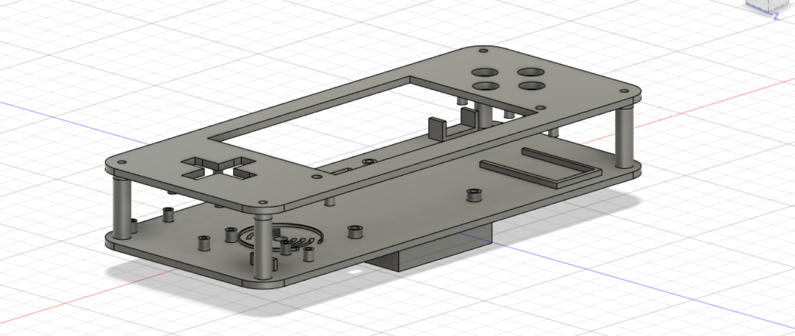
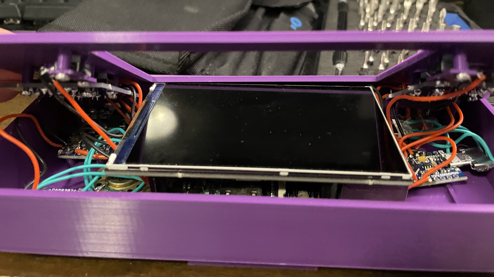

CAD Files on <u><a>[Github](https://github.com/AnnoyingDoge/CAD-Projects/tree/main/Pi%20Handheld)</a></u>!

## Introduction and CAD

This is a CAD drawing of a Raspberry Pi handheld I designed in Fusion 360. This project was completed in ninth grade, and it was one of my first large projects in Fusion 360. As such, there were a lot of mistakes in designing it, as well as many things I learned. Of note, the tolerances were poor and I did not print out enough prototypes. At the time, I was worried about wasting plastic, however I could have simply printed out small sections of the case and test fit the electronics. As a result, the Arduino and power switch did not fit well, and had to be glued in place. Further, I hadn’t yet learned enough about assembling parts in CAD nor did I consider using snap-fit joints, which would have made the whole process much smoother. However, I learned to work with 2D schematics and 3D libraries as references for design, general design rules for 3D printing, and to bring together a variety of electronics to make a functional device.

## Electronics

Some highlights of the internals include:
1. Raspberry Pi 3B
2. Custom Button PCBs
3. Pimoroni HyperPixel Display
4. Adafruit speaker and amp
5. An Arduino Pro-Micro for input handling

The electronics of this handheld were the most rewarding part of the design process. Originally, my plan was to use a low-resolution TFT display as well as hard plastic buttons. However, I decided that I wanted to build a device that I would actually want to use. So, I picked a LCD screen, which used up just about all of the GPIO pins, as well as silicone buttons. Due to the few GPIO pins available, wiring buttons to them would not work. So, after researching online, I decided arduino might be the way to go. The arduino pro-micro has great support for using it as an HID device, so I picked this, as well as choosing to make some button PCBs to make the internal structure simpler. However, I had limited experience with both Arduino and PCB design, so I spent hours online watching researching software, watching tutorials, and making mistakes. In any case, I learned a lot through the process and by seeing the errors that I now know to avoid.

 button PCBs.")

This is a PCB designed in EAGLE for use in the Raspberry Pi handheld project. The PCB is fairly simple, mostly serving as a convenient way to mount the buttons and keep wiring clean. Each switch is connected to a corresponding signal pin, as well as a common ground, the “GI” pin. Extra ground pins were added so that multiple PCBs could share ground, if desired. At the point in the project where I had decided to use a PCB, I had no knowledge of PCB design, and took the opportunity to learn. I watched EAGLE tutorials, read up on how to import libraries (used for the Adafruit buttons), researched PCB manufacturers, and looked at basic circuit design. The final product worked well for its use case, though I believe the overall footprint of the PCB could be reduced by changing the mounting holes and I/O pins.