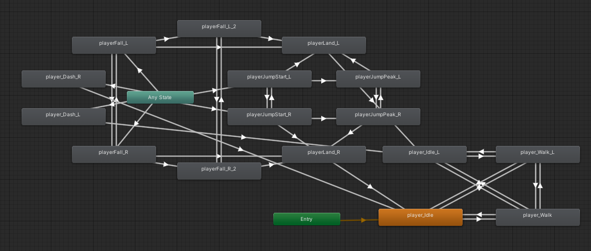

## Introduction

Type here

## Unity Editor / Gameplay

Type here

## Code

Type here

```Csharp
//Just the pieces of the dash from the movement script.
private void startDash()
{
    if (canDash && (!dashing || canCancelDash)) //&& (Mathf.Abs(x) > 0 || Mathf.Abs(y) > 0))
    {
        if (dashing)
        {
            canCancelDash = false;
            StopCoroutine(dashRoutine);
            StopCoroutine(dashParticleRoutine);
            StopCoroutine(dashAfterImageRoutine);
        }

        Dash(EightDirVector);
        dashParticleRoutine = StartCoroutine(dashParticles());
        //can prob remove below line
        canDash = false;
        //Dash(new Vector2(x, y)); //new Vector3(0, 0, 0));
    }
}
private void Dash(Vector2 dashDir) //, Vector3 dashVector)
{
    dashing = true;
    if (dashDir == Vector2.zero)
    {
        if(animScript.facingRight)
        {
            dashDir = Vector2.right;
        }
        else
        {
            dashDir = Vector2.left;
        }
    }
    bJump.enabled = false;
    PlayerRB2D.velocity = (Vector2.zero);
    PlayerRB2D.velocity += (dashDir.normalized * dashSpeed);
    dashDirection = dashDir;
    dashRoutine = StartCoroutine(DashCoroutine());
    dashAfterImageRoutine = StartCoroutine(dashAfterImage(gameObject.GetComponent<SpriteRenderer>()));
}


//EndDash is referenced by other classes, hence it being public.
public void EndDash(bool doSlowDown)
{
    if (dashing)
    {
        if(doSlowDown)
        {
            //PlayerRB2D.velocity = new Vector2(x * speed, 0);
            //PlayerRB2D.velocity = new Vector2(0, 0);
        }
        PlayerRB2D.velocity = new Vector2(PlayerRB2D.velocity.x, 0);

        //PlayerRB2D.velocity = new Vector2(x * speed, y * speed);
        PlayerRB2D.gravityScale = gravScale;
        dashing = false;
        bJump.enabled = true;

        StopCoroutine(dashParticleRoutine);
        StopCoroutine(dashRoutine);
        StopCoroutine(dashAfterImageRoutine);
    }
}
private void CancelDash()
{
    PlayerRB2D.gravityScale = gravScale;
    dashing = false;
    bJump.enabled = true;

    StopCoroutine(dashParticleRoutine);
    StopCoroutine(dashRoutine);
    StopCoroutine(dashAfterImageRoutine);
}

private IEnumerator DashCoroutine() //, Vector3 dashVector)
{

    PlayerRB2D.gravityScale = 0;
    canCancelDash = false;

    yield return new WaitForSeconds(dashTime / 2);

    canCancelDash = true;

    yield return new WaitForSeconds(dashTime / 2);
    canCancelDash = false;

    EndDash(true);
}
//See animation section for dash effect methods!
```

Inline code: `print()`

Type here

## Animation



Type here

```Csharp
private IEnumerator dashParticles()
    {
        float particleTime = 0.05f * Random.Range(1.0f, 2.0f);

        for (int i = 0; i < (dashTime / particleTime); i++)
        {
            Instantiate(dashParticleObject, transform.position, Quaternion.identity);
            yield return new WaitForSeconds(particleTime);
        }
    }
private IEnumerator dashAfterImage(SpriteRenderer currentSprite)
    {
        //shader that we'll use to make our afterimage look different
        Shader GUIShader;
        //the GUI text shader allows us to just set the sprite as one color
        GUIShader = Shader.Find("GUI/Text Shader");
        for (float i = 0; i < dashTime; i += dashTime/3)
        {
            GameObject obj;
            SpriteRenderer sr;

            //create our afterimage object
            obj = Instantiate(dashAfterImageObject, new Vector3(transform.position.x, transform.position.y, transform.position.z + 1), Quaternion.identity);

            //Scale and sprite set
            obj.transform.localScale = gameObject.transform.localScale;
            sr = obj.AddComponent<SpriteRenderer>();
            sr.sprite = currentSprite.sprite;

            //some hacky renderer stuff to make the sprite single color
            sr.material.shader = GUIShader;
            
            //white with 50% opacity
            sr.color = new Color (1, 1, 1, 0.5f);

            
            sr.flipY = (Mathf.Sign(gravScale) == -1);

            //Wait to loop again
            yield return new WaitForSeconds(dashTime / 3);
        }
        yield return null;
    }
```

Type here