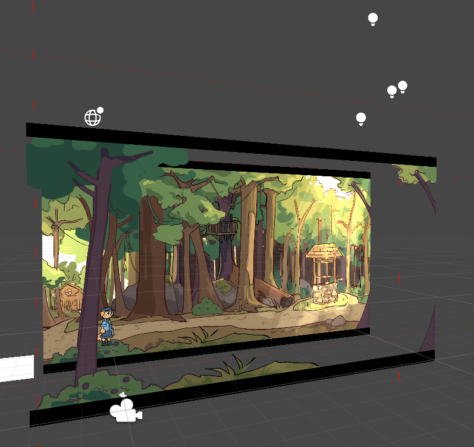

View the code on <u><a>[Github](https://github.com/AnnoyingDoge/DogGameCode)</a></u>!

Visit our <u><a>[Website](http://playfetch.net)</a></u>!

<iframe width="560" height="315" src="https://www.youtube.com/embed/oBMOtgGY95Y" title="YouTube video player" frameborder="0" allow="accelerometer; autoplay; clipboard-write; encrypted-media; gyroscope; picture-in-picture" allowfullscreen></iframe>

## Introduction
(Update: Fall 2023)

Sadly, development has been put on hold since spring of 2023. We had varying commitments leading up to fall 2023, and then started our first year of college at various institutions. Hopefully, we can continue work on the project, but either way, we enjoyed it. I built out most of the features for the first chapter, so we may return to at least finish that.

(Original Article: October 29, 2022)

Fetch is an indie 2D platformer which I was developing alongside artist and lead writer <u><a>Rachel Chen</a></u> and composer <u><a>Declan Scully</a></u>. The final game will have five chapters, featuring unique areas, each with their own aesthetic, music, and gameplay elements.

The game is made in Unity, with all code written in C#. Most of this code can be found in the Github repository above. Rather than using Github for the entire project, I’m using Plastic SCM, as it better integrates with larger, Unity-specific assets.

As a team of new developers, it's been a challenging process. In June, Rachel was new to animation, Declan hadn’t made a soundtrack before, and I was a Unity novice. At every turn, we're facing new problems. For my part I've worked through each problem by trying to code a solution, then troubleshooting by reading documentation, forums, or rewriting my code entirely. We've been staying organized through ClickUp. Coordinating our work on the project has been difficult, but we plan to deliver the first ‘chapter’ by June.

Lastly, I want to make clear what resources that I used, beyond those which might be considered common knowledge. The script which handles jumping (betterJump.cs) is based on a <u><a>[tutorial by Board To Bits Games](https://www.youtube.com/watch?v=7KiK0Aqtmzc)</a></u>. My collision script takes inspiration from a <u><a>[repository by Mix and Jam](https://github.com/mixandjam/Celeste-Movement)</a></u>. 


## Unity Editor / Gameplay



As the programmer and game designer, I have been working on implementing efficient levels with unique design and style. The main concern has been the trade-off between the time to create many assets and quality. To maintain quality and reduce time, the plan is to layer backgrounds, tiles, prefab objects, and lighting, each with different depths and effects. Shown in this image is a concept, which uses a tree in the foreground, a separate background, and lighting to give the impression of space in a 2D level. Plans for the future include creating robust tiles and adding specific depth effects for each layer, such as parallax and blurring. Furthermore, I spent many hours on camera and level systems that are efficient and reusable.

The camera system and level load system were particularly challenging. The camera system is fairly simple. It checks which borders the camera is in contact with, and sets its desired position accordingly. Getting to this point was difficult, as I spent a long time figuring out how to access and parse the collider information. I had originally intended to use linear interpolation to have the camera follow slightly behind the player, but this causes issues. Fortunately, Unity has a solution. SmoothDamp, when called in a LateUpdate (called every frame after FixedUpdate and Update) accomplishes what I had desired from linear interpolation. The level load system was not as bad, as it allowed me to set which level to load and where the transition point is. The code for the camera and level loading systems can be found on the Github repository.

The general movement and gameplay systems can be seen on our website. As a quick summary, the dog is able to jump, run, wall jump, and dash. So, the game will focus on fast-paced, tight controlling platforming sections. More will be added to this section as gameplay is finalized!

## Sample Code

Here's a sample of some of the dash code! This is all contained within the movement script and handles dashing and calling any visual effect methods.

```Csharp
//Just the pieces of the dash from the movement script.
private void startDash()
{
    if (canDash && (!dashing || canCancelDash)) //&& (Mathf.Abs(x) > 0 || Mathf.Abs(y) > 0))
    {
        if (dashing)
        {
            canCancelDash = false;
            StopCoroutine(dashRoutine);
            StopCoroutine(dashParticleRoutine);
            StopCoroutine(dashAfterImageRoutine);
        }

        Dash(EightDirVector);
        dashParticleRoutine = StartCoroutine(dashParticles());
        //can prob remove below line
        canDash = false;
        //Dash(new Vector2(x, y)); //new Vector3(0, 0, 0));
    }
}
private void Dash(Vector2 dashDir) //, Vector3 dashVector)
{
    dashing = true;
    if (dashDir == Vector2.zero)
    {
        if(animScript.facingRight)
        {
            dashDir = Vector2.right;
        }
        else
        {
            dashDir = Vector2.left;
        }
    }
    bJump.enabled = false;
    PlayerRB2D.velocity = (Vector2.zero);
    PlayerRB2D.velocity += (dashDir.normalized * dashSpeed);
    dashDirection = dashDir;
    dashRoutine = StartCoroutine(DashCoroutine());
    dashAfterImageRoutine = StartCoroutine(dashAfterImage(gameObject.GetComponent<SpriteRenderer>()));
}


//EndDash is referenced by other classes, hence it being public.
public void EndDash(bool doSlowDown)
{
    if (dashing)
    {
        if(doSlowDown)
        {
            //PlayerRB2D.velocity = new Vector2(x * speed, 0);
            //PlayerRB2D.velocity = new Vector2(0, 0);
        }
        PlayerRB2D.velocity = new Vector2(PlayerRB2D.velocity.x, 0);

        //PlayerRB2D.velocity = new Vector2(x * speed, y * speed);
        PlayerRB2D.gravityScale = gravScale;
        dashing = false;
        bJump.enabled = true;

        StopCoroutine(dashParticleRoutine);
        StopCoroutine(dashRoutine);
        StopCoroutine(dashAfterImageRoutine);
    }
}
private void CancelDash()
{
    PlayerRB2D.gravityScale = gravScale;
    dashing = false;
    bJump.enabled = true;

    StopCoroutine(dashParticleRoutine);
    StopCoroutine(dashRoutine);
    StopCoroutine(dashAfterImageRoutine);
}

private IEnumerator DashCoroutine() //, Vector3 dashVector)
{

    PlayerRB2D.gravityScale = 0;
    canCancelDash = false;

    yield return new WaitForSeconds(dashTime / 2);

    canCancelDash = true;

    yield return new WaitForSeconds(dashTime / 2);
    canCancelDash = false;

    EndDash(true);
}
//See animation section for dash effect methods!
```

## Animation


The animation tree, pictured above, is a result of the collaboration process for this game. As Rachel and I were new to this process, we had many discussions on how we might implement dynamic animations. This animation tree is the result of these discussions and our individual work. The main concern we shared was maintaining Rachel’s style while implementing responsive animations. For example, the jump can end early, as the player may jump low or land on a higher platform. Thus, Rachel and I discussed how she might design a landing frame to ensure this wasn’t too jarring. Both of us researched other platformers, analyzing how other artists and developers handled the same issue. In the end, we landed on the system shown in the left side of the chart, with stages of jumping, falling, and a second falling stage, which could each be canceled by the landing animation. So, she created sprite sheets to fit this system, while I implemented the sprites into the game, following our plan.

In general, we're supplementing animation with effects generated within C# and the Unity Editor to achieve both visual stylization and incredibly dynamic effects. Below, there is some code which does this for the dash system. This generates particles for the dash, as well as an afterimage based on the players current sprite.

```Csharp
private IEnumerator dashParticles()
    {
        float particleTime = 0.05f * Random.Range(1.0f, 2.0f);

        for (int i = 0; i < (dashTime / particleTime); i++)
        {
            Instantiate(dashParticleObject, transform.position, Quaternion.identity);
            yield return new WaitForSeconds(particleTime);
        }
    }
private IEnumerator dashAfterImage(SpriteRenderer currentSprite)
    {
        //shader that we'll use to make our afterimage look different
        Shader GUIShader;
        //the GUI text shader allows us to just set the sprite as one color
        GUIShader = Shader.Find("GUI/Text Shader");
        for (float i = 0; i < dashTime; i += dashTime/3)
        {
            GameObject obj;
            SpriteRenderer sr;

            //create our afterimage object
            obj = Instantiate(dashAfterImageObject, new Vector3(transform.position.x, transform.position.y, transform.position.z + 1), Quaternion.identity);

            //Scale and sprite set
            obj.transform.localScale = gameObject.transform.localScale;
            sr = obj.AddComponent<SpriteRenderer>();
            sr.sprite = currentSprite.sprite;

            //some hacky renderer stuff to make the sprite single color
            sr.material.shader = GUIShader;
            
            //white with 50% opacity
            sr.color = new Color (1, 1, 1, 0.5f);

            
            sr.flipY = (Mathf.Sign(gravScale) == -1);

            //Wait to loop again
            yield return new WaitForSeconds(dashTime / 3);
        }
        yield return null;
    }
```

## Conclusion

We can't wait to release this game, so please stay tuned!