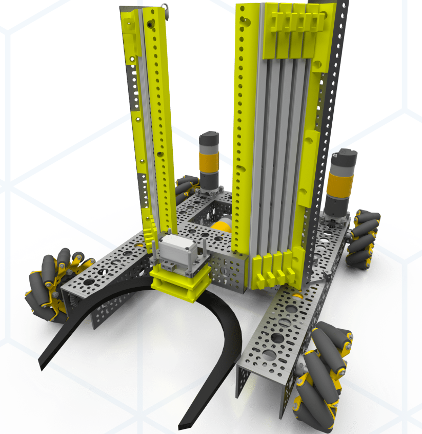
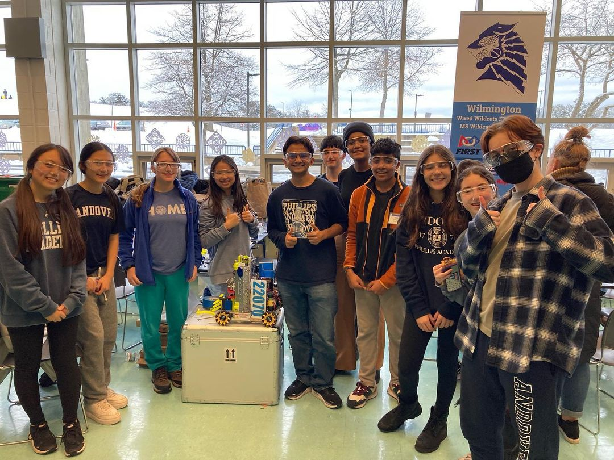

## Introduction

This year, we have established a rookie FTC team, PARC Acadia #22070. Much of the effort of this project has been setup and outreach, rather than actual “making.” The goal is to build a program that lasts and includes as many students as possible. I have previously been a design leader for VEX, but I have moved over to being one of the FTC software leads alongside Abby Andam. At the moment, we have completed code for the prototype robot. 

The first full iteration of our robot competed at a scrimmage in early December at Andover High School, achieving multiple wins, a success for our rookie team.  

After the V1.0 iteration of our robot, we went back and rebuilt a few systems. First, we changed the robot's lift mechanism, transitioning from a single set of GoBuilda slides to two sets of Misumi slides. The two sets of slides were placed perpendicular to each other, which helped stability. Other changes included a slightly smaller drive train, more robust mounting for the control hub and camera, and a slightly improved claw. 

On the software team, we worked to develop a better autonomous opmode, building a TensorFlow Lite model to detect the parking-indicator cone in the first few seconds of the round. This allowed us to score an easy 20 points before the driver control period had even started. Though we do not yet have deadwheels for perfectly accurate odometry, we also implemented the Roadrunner library in our autonomous, tracking the position and heading of our robot using the built-in motor encoders and control hub IMU. This is accurate enough in the 30 second autonomous period, but isn't as useful in the driver control period, as the localization starts to 'drift' without the use of deadwheels. We hope to include deadwheels, allowing us to utilize automated actions during driver control to achieve more consistent results.

We attended our first competition on January 21, placing fifth in the preliminary rounds, and making it to top eight in the elimination rounds. As a rookie team, comprised mostly of new members, we are incredibly proud of this result. While the hardware team is building out new features before the next competition (including deadwheel odometry for use by the Roadrunner library), we are beginning work on a website built in Gatsby, as well as improving image recognition for the next revision. 

For robot code, we’re using Android Studio and the <u><a>[FTC Robot Controller Library](https://github.com/FIRST-Tech-Challenge/FtcRobotController)</a></u>. Check out our <u><a>[robot code repository](https://github.com/FTC-PARC-Acadia/Power-Play)</a></u> as well as our <u><a>[website repository](https://github.com/FTC-PARC-Acadia/PARC-Website)</a></u>. Abby Andam is largely leading the website effort, as I have little JSX experience.