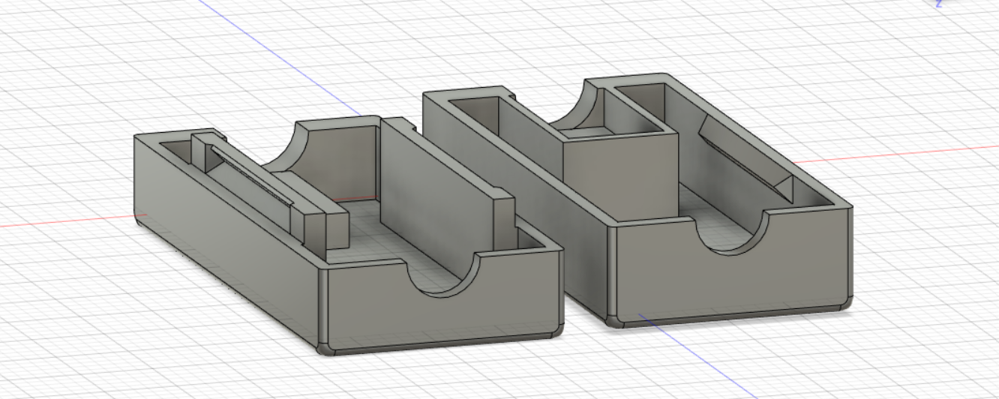

## Introduction

This project started after a conversation I had with my friend Trevor. We both had been experiencing some static/noise on our low impedance IEMs, so I threw together a breadboard circuit and tried artificially increasing impedance using 22 ohm resistors. After hearing the static disappear, I decided to make a cheap, portable version of this device for him and I.

Initially, the idea for the device was a cable with built in resistors, but after some prototyping, I was concerned that the final product may be more fragile this way. So, I pivoted, designing a case in CAD to protect the internals.

## Prototyping

When testing my first complete prototype, I noticed that the effect 22 ohm resistors had was much less than the breadboarded version with the same resistors, likely due to the resistance the breadboard itself had introduced. Thus, I re-tested multiple higher ohm values, landing on 100 ohm resistors.

In the final product, there are three 100 ohm resistors, one for each pin. The 3.5mm audio jack parts were sourced from Sparkfun, simply using an audio plug and jack (<u>[COM-11143](https://www.sparkfun.com/products/11143)</u> and <u>[PRT-12639](https://www.sparkfun.com/products/12639)</u>). In total, the device only cost a few dollars to make, but helped fix a common problem both Trevor and I had experienced.

## Design and Printing

When designing this device, there were a few general goals:

  1. Usability and feel

  2. Ease of repair and modification

  3. Portability

As such, there were some immediate decisions made before drawing anything in Fusion 360. First, no screws or glue would be used. Rather, snap-fit joints with tight tolerances would hold everything together, including the electronics. Second, these snap-fit joints could not come apart too easily. Lastly, the device had to stay relatively small, yet strong.

So, recalling some of my previous projects, I utilized <u>Adafruit's</u> snap-fit tutorial. After some CAD work, I printed an initial design. Immediately, the electronics were way too loose in their respective spots. Both the audio plug and jack had a lot of room to wobble around without much force applied. The snap fit joints were also loose, making the device feel as if it could easily fall apart.

Returning to Fusion, I worked on tightening the tolerances further, printing many more prototypes. After many revisions, and some slight increases in space for the resistors, a final version was printed and soldered together. The only piece with any wobble is the plug, but it only does so with a very intentional force. The case doesn’t come apart in normal use, but is easy to pull apart for repairs or changes, achieving my original design goals.