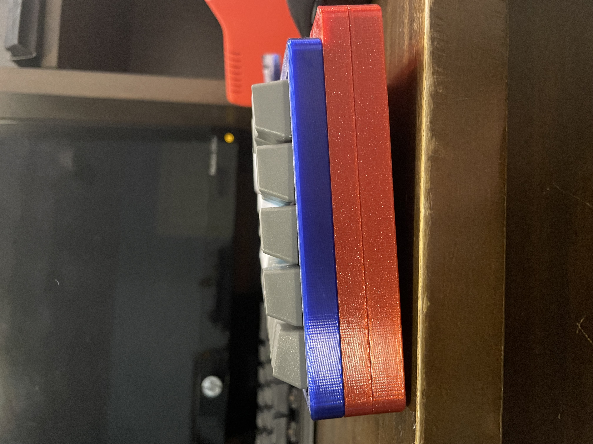

## Introduction

This is the side view of a keyboard I 3D printed and hand-wired using Cherry switches and a Teensy 2.0. The design is by <u><a>[Thingiverse user FedorSosnin](https://www.thingiverse.com/thing:3478494)</a></u> though I have made some modifications. It was a fun project I did over the weekend during the summer before eleventh grade. Since the entire device is hand-wired, most of this project was soldering. Since the solid-core wire I had on hand was thicker than I had anticipated, the case wouldn’t close after soldering. So, I drew up a spacer in Fusion 360 and 3D printed it, saving me the time of having to rewire the entire keyboard. After completing the project, I struggled to actually use the keyboard, as the flat profile hurt my wrists. I returned to Fusion 360 to design a piece that would add five degrees of tilt to the board, which worked after a few prototypes. 

The files can be found on my Github or at this link on <u><a>[Thingiverse.](https://www.thingiverse.com/thing:4936789)</a></u> My hope, in uploading them, is that users with the same issue could have a quick and easy solution.

## Wiring

The wiring of this keyboard was a long process. There are simply too many joints for this to be done quickly, and getting the wire insulation to be spaced correctly was difficult with the wire strippers I had on hand. Yet, I had a really fun time wiring it. There’s something relaxing to me about soldering. Usually, it’s the point in the project where there’s some stress about whether everything is going to work, but there’s a break in the action to carefully put it together. In the end, the wires I used were so stiff that the case wouldn’t close, and I designed a spacer, as discussed in the other photo of this keyboard. However, I found myself enjoying the process, despite this setback, and being even more satisfied with the keyboard in the end.

